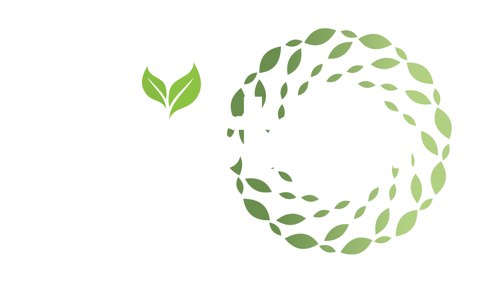

# SustainSync Website



A modern, responsive website for the SustainSync senior computing project, built with React, TypeScript, and Material-UI.

## 🌟 Features

- **Modern UI**: Built with Material-UI (MUI) components
- **Responsive Design**: Fully responsive across all devices
- **Video Integration**: Sections for presentation and demo videos
- **Project Showcase**: Detailed project overview and technology stack
- **Team Profiles**: About page with team member information and social links
- **GitHub Pages Ready**: Configured for easy deployment

## 🚀 Getting Started

### Prerequisites

- Node.js (v18 or higher)
- npm or yarn

### Installation

1. Clone the repository:
```bash
git clone https://github.com/SustainSync/SustainSync-Website.git
cd SustainSync-Website
```

2. Install dependencies:
```bash
npm install
```

3. Run the development server:
```bash
npm run dev
```

4. Open your browser and navigate to `http://localhost:5173`

## 📦 Building for Production

Build the project:
```bash
npm run build
```

Preview the production build:
```bash
npm run preview
```

## 🌐 Deployment to GitHub Pages

This project is configured to automatically deploy to GitHub Pages via GitHub Actions.

### Setup Instructions:

1. Go to your repository settings on GitHub
2. Navigate to **Pages** under **Code and automation**
3. Set **Source** to "GitHub Actions"
4. Push to the `main` branch to trigger automatic deployment

The site will be available at: `https://sustainsync.github.io/SustainSync-Website/`

## 🎨 Customization

### Adding Your Videos

Edit `/src/pages/Home.tsx` and replace the YouTube video IDs:
- Line ~45: Replace `YOUR_PRESENTATION_VIDEO_ID`
- Line ~83: Replace `YOUR_DEMO_VIDEO_ID`

### Updating Team Information

Edit `/src/pages/About.tsx` and modify the `teamMembers` array (starting around line 11):
```typescript
const teamMembers: TeamMember[] = [
  {
    name: 'Your Name',
    role: 'Your Role',
    bio: 'Your bio...',
    linkedin: 'https://www.linkedin.com/in/your-profile',
    github: 'https://github.com/your-profile',
  },
  // Add more team members...
];
```

### Modifying the Technology Stack

Edit `/src/pages/Home.tsx` in the "Technology Stack" section (starting around line 150) to add or remove technologies.

### Changing the Theme

Edit `/src/App.tsx` and modify the `createTheme()` configuration to change colors, typography, and component styles.

### GitHub Repository Link

Update the GitHub link in:
- `/src/components/Navbar.tsx` (line ~80)
- `/src/components/Footer.tsx` (line ~53)

Replace `https://github.com/SustainSync` with your actual repository URL.

## 🛠️ Tech Stack

### Frontend
- **React** - UI library
- **TypeScript** - Type-safe JavaScript
- **Material-UI (MUI)** - Component library
- **Vite** - Build tool and dev server
- **React Router** - Client-side routing

### DevOps
- **GitHub Actions** - CI/CD pipeline
- **GitHub Pages** - Hosting
- **ESLint** - Code linting

## 📁 Project Structure

```
SustainSync-Website/
├── .github/
│   └── workflows/
│       └── deploy.yml          # GitHub Actions workflow
├── public/
│   ├── brand-logo.svg          # SustainSync logo
│   └── brand-logo copy.svg
├── src/
│   ├── components/
│   │   ├── Navbar.tsx          # Navigation bar
│   │   └── Footer.tsx          # Footer component
│   ├── pages/
│   │   ├── Home.tsx            # Home page
│   │   └── About.tsx           # About/Team page
│   ├── App.tsx                 # Main app component
│   ├── main.tsx                # App entry point
│   └── index.css               # Global styles
├── index.html                  # HTML template
├── package.json                # Dependencies
├── tsconfig.json              # TypeScript config
├── vite.config.ts             # Vite config
└── README.md                   # This file
```

## 📝 Available Scripts

- `npm run dev` - Start development server
- `npm run build` - Build for production
- `npm run preview` - Preview production build
- `npm run lint` - Run ESLint

## 🤝 Contributing

This is a senior computing project. For contributions or questions, please reach out to the team members listed on the About page.

## 📄 License

This project is part of a senior computing project.

## 🌱 About SustainSync

SustainSync is an innovative sustainability management platform designed to help organizations track, analyze, and optimize their environmental impact. Built as a senior computing project, it demonstrates the power of modern technology in addressing critical environmental challenges.

---

Made with 💚 by the SustainSync Team
